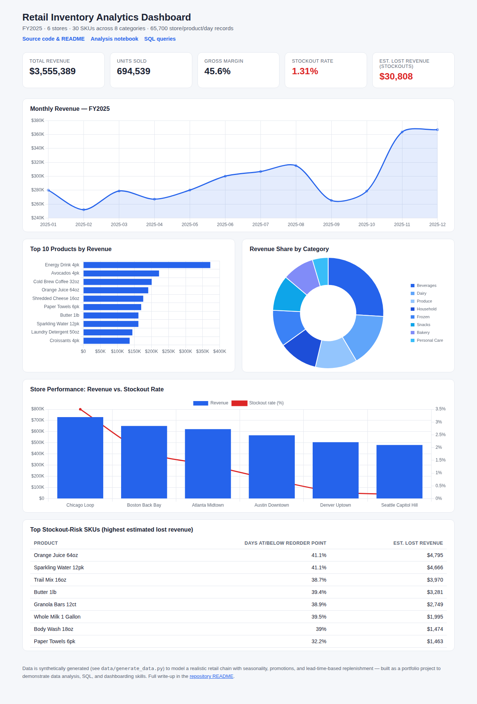

# Retail Inventory Analytics

**Live dashboard:** https://jh1990651.github.io/retail-inventory-analytics/dashboard.html
*(link goes live once GitHub Pages is enabled for this repo — see [Deploying your own copy](#deploying-your-own-copy) below)*

A end-to-end data analysis project simulating one year of sales and inventory
for a 6-store retail chain: a reproducible synthetic dataset, a Python/pandas
analysis notebook, SQL queries, and a live HTML dashboard — built to
demonstrate the kind of analysis a Data Analyst does day to day: turning raw
transactional data into specific, prioritized business recommendations.



## Business question

Across a 6-store chain, where is inventory being managed well, where is it
costing us in lost sales (stockouts) or tied-up cash (slow-moving stock), and
what should the ops team fix first?

## Key findings

- **$3.55M revenue** across 694,539 units sold in FY2025, at a **45.6% gross
  margin**.
- **A 1.31% chain-wide stockout rate** — small-sounding, but across 65,700
  store/product/day records it works out to an estimated **$30.8K in lost
  revenue**, concentrated in a handful of SKUs (Orange Juice 64oz, Sparkling
  Water 12pk, and Trail Mix 16oz alone account for over $13K of it). Fixing
  reorder points on just those SKUs is a far more targeted intervention than
  raising safety stock chain-wide.
- **Classic 80/20 pattern**: 17 of 30 SKUs ("A" class) drive 78% of revenue.
  Those are the products where a stockout hurts most and where inventory
  should be prioritized.
- **Stockout rate scales with store volume, not randomly** — Chicago Loop,
  the highest-revenue store, also has by far the highest stockout rate
  (3.5% vs. 0.17% at the lowest-volume store), and every store's stockout
  rate tracks its revenue rank almost exactly. Reorder points are set per
  product in this dataset, not per store, so high-traffic locations burn
  through the same reorder point faster. **Store-aware reorder points would
  likely close most of this gap.**
- **Inventory turnover varies widely by SKU** — the slowest-turning products
  tie up cash disproportionate to the revenue they generate and are
  candidates for markdown or reduced order quantities.

Full methodology, charts, and code behind every number above:
[`notebooks/analysis.ipynb`](notebooks/analysis.ipynb).

## Repository structure

```
data/
  generate_data.py            reproducible synthetic data generator
  stores.csv                  dimension: 6 stores
  products.csv                dimension: 30 SKUs across 8 categories
  inventory_transactions.csv  fact table: 65,700 store/product/day rows
notebooks/
  analysis.ipynb              full pandas analysis, executed with outputs
  build_notebook.py           builds + executes the notebook from source
sql/
  schema.sql                  normalized schema (stores/products/transactions)
  queries.sql                 7 analyst queries: revenue trend, ABC/Pareto,
                               turnover, stockout risk, store ranking, etc.
  run_queries.py              loads the CSVs into SQLite and runs queries.sql
  sample_output.txt           actual output of every query, for reference
assets/
  dashboard_summary.json      metrics exported from the notebook
  *.png                       charts exported from the notebook
vendor/
  chart.umd.js                Chart.js, vendored so the dashboard has no
                               external runtime dependency
dashboard_template.html       dashboard source (data placeholder)
build_dashboard.py            injects dashboard_summary.json -> dashboard.html
dashboard.html                the generated, deployable dashboard (GitHub Pages)
```

## Tools & skills demonstrated

- **Python / pandas** — data cleaning, groupby aggregation, time-series
  resampling, window-style ranking, KPI computation
- **SQL** — joins, `GROUP BY` aggregation, `WINDOW` functions (`RANK()`,
  running cumulative share for Pareto analysis), `FILTER` clauses, CTEs
- **Data visualization** — matplotlib (notebook) and Chart.js (dashboard):
  trend lines, bar/horizontal-bar, donut, dual-axis combo charts
- **Business analysis** — ABC/Pareto classification, inventory turnover
  ratio, stockout/reorder-point risk analysis, KPI framing for a
  non-technical audience
- **Reproducibility** — every artifact (dataset, notebook outputs, SQL
  results, dashboard) is generated by a script, not hand-edited

## How the data was built

`data/generate_data.py` simulates daily point-of-sale demand and
reorder-point-based inventory replenishment (with per-product lead times) for
each store/product pair across FY2025 — so stockouts, seasonality (holiday
spike, summer beverage bump), and slow movers emerge naturally from the
simulation rather than being hard-coded. See the script for exact demand and
replenishment logic.

## Reproducing this locally

```bash
pip install pandas numpy matplotlib nbformat nbclient ipykernel

python3 data/generate_data.py       # regenerate data/*.csv
python3 notebooks/build_notebook.py # re-run the full analysis notebook
python3 sql/run_queries.py          # run sql/queries.sql against SQLite
python3 build_dashboard.py          # rebuild dashboard.html from latest data
```

Open `dashboard.html` directly in a browser (no server needed — the chart
library is vendored locally and the data is inlined) or serve the repo root
with GitHub Pages.

## Deploying your own copy

To get the live dashboard link working on a fork or your own copy of this repo:

1. **Settings → Pages** → Source: *Deploy from a branch* → Branch: `main`,
   folder: `/ (root)` → Save.
2. Wait a minute or two, then visit
   `https://<your-username>.github.io/<repo-name>/dashboard.html`.

## Data note

All data in this project is **synthetically generated** (see
`data/generate_data.py`) — it is not real sales data from any company. It's
built to be *realistic* (genuine seasonality, promotions, and emergent
stockouts) precisely so the analysis techniques generalize to real retail
data.
